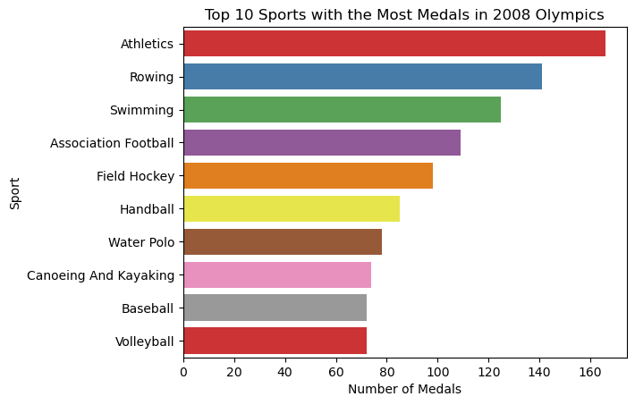
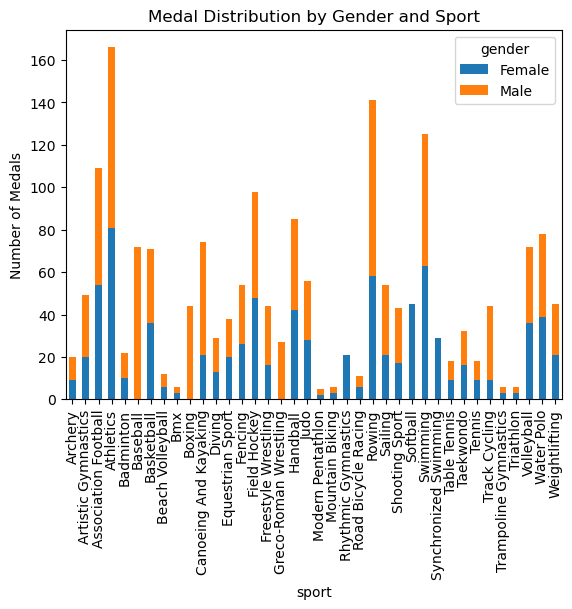
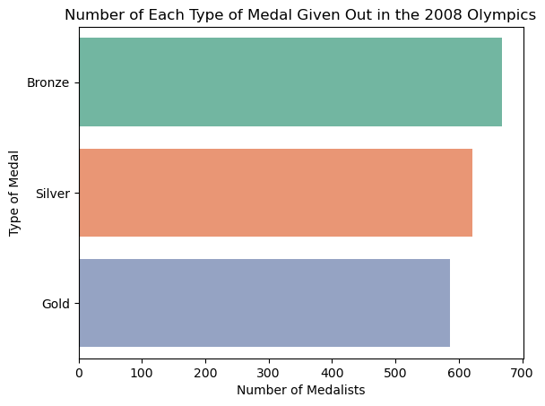

# 2008 Olympics Medalists Data Cleaning & Analysis
This project uses data cleaning and tidying principles to reshape and transform the 2008 Olympic Medalist Dataset. For this particular analysis, I want to evaluate how the number of medals collected differs by sport, and by gender within each sport. 

### Project Goals:
- Apply tidy data principles to clean data
- Transform data
- Perform basic exploratory data analysis utilizing visualizations and pivot tables

*What is tidy data?*
Tidy data is data that is cleaned efficiently and effectively so that data can be manipulated, modeled, and visualized. It utilzies a structure where...
1. Each variable forms a column
2. Each observation forms a row
3. Each type of observational unit forms a table

## Exploratory Data Analysis & Visualization:

**Top 10 Sports** by medal count

**Medal Gender Distribution** across all sports

**Medal Type Distribution**

## Pivot Table:
Two **pivot tables** were created to provide a clearer look at the data and to be used with the visuals. Both were indexed by sport, but one looked at the gender breakdown of medals earned and the other looked at the breakdown of the type of medal received.

## Technologies Used:
- Python (Pandas, Matplotlib, Seaborn)
- Jupyter Notebook
- GitHub

## Instructions:
1. Clone the repository and install dependencies (`pip install pandas matplotlib seaborn`)
2. Run the Jupyter Notebook step by step
3. Review visualizations and pivot table insights

## References:
- [Pandas Cheat Sheet](https://pandas.pydata.org/Pandas_Cheat_Sheet.pdf)
- [Tidy Data Principles](https://vita.had.co.nz/papers/tidy-data.pdf)
